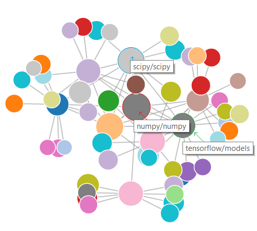
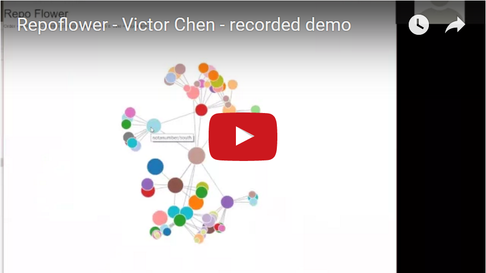

Repoflower
==========

_See how GitHub Repos depend on one another_

Repoflower was my project for [Insight Data Engineering](http://insightdataengineering.com/), Fall 2016 Session C.

## Intro

How many repositories depend on my own repository? **Repoflower** can answer that! It is a data pipeline that analyzes (Python & Go) source files found on GitHub repositories (repos) to then discover how individual repos import/depend on other repos. It makes use of the following technologies:

* Google BigQuery (for obtaining raw GitHub source files)
* Avro
* AWS S3
* Apache Spark 1.6.1
* Redis 3.2.4
* Elasticsearch 2.3.3
* Riak 2.7.0
* Flask 0.11.1
* D3.js 4.2.6

The pipeline is generic enough to extend to other programming languages such as Javascript and Rust.

## Data

[GitHub Archive](https://www.githubarchive.org/) is a public dataset stored on [Google BigQuery](bigquery.cloud.google.com) which contains GitHub API "events" (such as opening a new ticket, commenting, committing) as well as unique file contents of text files under 1MiB on the HEAD branch of its respective repository. The BigQuery table containing the file content holds 197,181,987 source files, overall spanning 1.65TB.

The dataset resides on 5 main tables, of which I used 3 to filter only repository information, file meta-data, and content (source file) tables. I also filtered down to just the Python and Go languages. Francesc Campoy from the Google Cloud team has an excellent [tutorial](https://medium.com/google-cloud/analyzing-go-code-with-bigquery-485c70c3b451#.ge5eov6l5) on how to extract Go files from the BigQuery table. His guide can apply to any other programming language.

For reference, here are the schema of the tables I've used:

**contents**

| id | size | content | binary | copies |

**files**

| repo_name | ref | path | mode | id | symlink_target |

**repos**

| user | repo_name | num_bytes |

The data is then transferred from BigQuery into Google Cloud storage buckets via the [Avro](https://avro.apache.org/) serialization format. From there, the data is transferred again into S3 because we, the Insight Data Engineering Fellows, were are the AWS infrastructure.

Finally, the Avro files are streamed into Spark for batch processing. Serialization was primarily used for reducing network traffic of data transfer.

## Pipeline

Since the data is divided across 3 tables, work must be done in joining and aggregating them. The content and file data resided on Spark, while Elasticsearch served as a look-up-table for the GitHub repository names. Spark extracts the dependency information from the import statements of the Python/Go source files via Regex. It ignores dependencies that:

1. refer to a module/package within the same repository
2. are built-in modules (e.g. `system` or `os` for Python, `math` or `fmt` for Go)
3. refer to non GitHub public repos

Spark takes care of step 1 through aggregation, while steps 2 and 3 are handled by Spark querying Elasticsearch for dependency-to-repository matching. In other words, Spark queries Elasticesearch to find the GitHub repository associated with the dependency found in each source file.

This information is aggregated/shuffled to build a graph in adjacency-list format, which is ultimately stored on Riak. Flask/D3.js will pull from Riak to visualize repo-to-repo connections. Since each repo can potentially have tens of thousands of repos that are dependent on it (e.g. `numpy/numpy`), for visualization purposes, I limit the max distance from the queried repo to 2 and node [degree](https://en.wikipedia.org/wiki/Degree_(graph_theory)) to 8. These parameters can be changed to ones liking.

## Video

